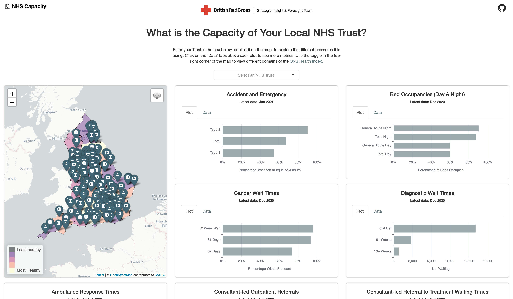

# NHS Capacity 

## Overview
An NHS Trust level view of the current health system capacity in England. To view the dashboard, click [here](https://britishredcross.shinyapps.io/nhs-capacity/).

 

## Navigation

- **`app/`** hosts a self-contained R Shiny app.
- **`data/`** contains all data.
- **`analyse/`** contains scripts to generate data and insights.

## Data sets

Data set | Date
--- | ---
A&E Attendance | Feb 21
Ambulance Responce Times | Feb 21
Bed Occupancy (Day & Night) | Dec 20
Cancer Waiting Times | Apr 21
Diagnostic Waiting Times | Jan 21
Outpatient Referrals | Jan 21
Referral to Treatment Waiting Times | Jan 21

## Contributing
To contribute to this project, please follow [GitHub Flow](https://guides.github.com/introduction/flow/) when submitting changes.

> Please note that this project is released with a Contributor Code of Conduct. By participating in this project you agree to abide by its terms.

## Getting help
If you encounter a clear bug, please file a minimal reproducible example in [issues](https://github.com/britishredcrosssociety/local-lockdown/issues).

## Credit
[Contains public sector information licensed under the Open Government Licence v3.0.](http://www.nationalarchives.gov.uk/doc/open-government-licence/version/3/)
